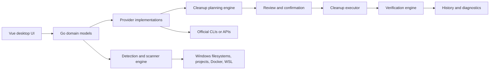

# Architecture and M1 implementation

The M1 bootstrap is implemented in the worktree. `main.go` hosts the Wails application, `AppService` exposes typed bindings, `internal/core` owns the fixture lifecycle, and `internal/history` persists verified fixture outcomes. The broader provider, Docker/WSL, project-discovery, and elevation designs remain planned rather than implemented.



## Boundary rules

- Vue renders provider, category, action, risk, recovery-cost, size, progress, and history domain models. It does not own raw shell commands.
- A provider owns detection, inspection, estimate, plan, execution, verification, version-aware semantics, and user-facing consequence data for one ecosystem.
- The planning engine creates explicit reviewable actions before any destructive operation begins.
- The executor handles cancellation, timeout, logs, errors, elevated operations, and partial completion.
- The verification engine remeasures provider state and physical disk state when meaningful, then records actual outcomes.
- Docker resource classes and virtual disks are not treated as interchangeable cache locations.

## Build-environment boundary

All project dependency installation, code generation, verification, tests, builds, and packaging execute inside Docker. The Windows host may run the editor, Git, Rancher Desktop/Docker, and `docker compose` only as the orchestrator; it does not provide a Go, Wails, Bun, Vue, or Windows packaging toolchain for PenguinSpace.

The frontend contract is Vue 3 + TypeScript + Vite, using pinned Bun `1.3.14` as the only JavaScript package manager and script runtime. The repository will commit `bun.lock` only; it will not introduce a Node/Corepack requirement or competing JavaScript lockfile. The initial frontend source must include `src/vite-env.d.ts`, with the `vite/client` reference and a `*.vue` module declaration, so the Bun-created Vue template type-checks reliably.

`Dockerfile` copies the pinned Bun binary into the pinned Go image and installs Wails CLI `v3.0.0-beta.6`. Compose provides `verify`, `build`, and `shell`; its Go module/build, Bun download, and frontend `node_modules` caches are named volumes. `verify` runs locked Bun installation, binding generation, Vue checks/build, Go internal vet/tests, and a Windows cross-compile. `build` runs Wails and writes `out/penguinspace.exe`. PowerShell delegates under `scripts/` call Compose only.

## Persistence and privilege boundaries

Measurements are stored as exact `uint64` byte values with a separate provenance/value-kind field: measured, estimated, logical deletion, or physical reclamation. Formatting into IEC units is a presentation concern only.

The implemented store uses pure-Go `modernc.org/sqlite` `v1.56.0`. It creates a SQLite database at `%LOCALAPPDATA%\\PenguinSpace\\penguinspace.db` on Windows, creates the initial `cleanup_history` table, and records SQLite `user_version = 1`. It currently persists fixture history only; settings, plans, outcomes, retention, and diagnostics remain M1 follow-on work. The application does not open an untrusted database file as its own state.

The desktop process remains non-elevated. A privileged operation is still a planned, validated, narrowly scoped plan passed to a separate helper launched via Windows UAC `runas`; that helper has not yet been implemented or runtime-verified.

## Provider lifecycle

```text
Detect → Inspect → Measure → Classify → Estimate → Plan → Confirm → Execute → Verify → Record history
```

The UI can display a plan only after classification. A plan must expose provider/item, current and estimated reclaimable size, risk, recovery cost, consequence, privilege requirement, shutdown prerequisite, and verification approach.

## Required core models

- Provider and detected environment
- Storage item and storage class
- Cleanup action and cleanup plan
- Risk and recovery-cost enums
- Measurement, estimate, logical deletion result, and physical reclamation result
- Execution status, progress, cancellation/error outcome, log/diagnostic context
- Scan result and cleanup-history record
- Workspace root, exclusions, and scanner rule

## Docker and WSL design constraints

Docker inspection and cleanup must distinguish build cache, images, stopped containers, networks, and volumes. Volumes are persistent-state candidates and therefore Danger.

WSL/VHDX needs a separate measurement path: distro/filesystem logical usage, backing VHDX path, physical size, estimated compactability, and physical size after compaction. Logical deletion is never evidence of host-disk reclaim until post-operation verification.

## Proposed UI architecture

The app shell contains the left navigation and compact/responsive behavior. Domain pages use metrics, horizontal breakdowns, dense tables/lists, master-detail interactions, detail panes, review dialogs, progress, and contextual warning/confirmation surfaces. Design details are in [penguin-space.useguide.md](penguin-space.useguide.md).
