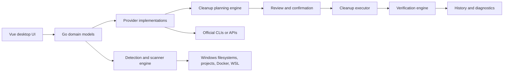

# Intended architecture

No source code exists at this baseline. This document describes the **planned** topology drawn from the approved proposal; it is not code-inspected architecture.



## Boundary rules

- Vue renders provider, category, action, risk, recovery-cost, size, progress, and history domain models. It does not own raw shell commands.
- A provider owns detection, inspection, estimate, plan, execution, verification, version-aware semantics, and user-facing consequence data for one ecosystem.
- The planning engine creates explicit reviewable actions before any destructive operation begins.
- The executor handles cancellation, timeout, logs, errors, elevated operations, and partial completion.
- The verification engine remeasures provider state and physical disk state when meaningful, then records actual outcomes.
- Docker resource classes and virtual disks are not treated as interchangeable cache locations.

## Provider lifecycle

```text
Detect → Inspect → Measure → Classify → Estimate → Plan → Confirm → Execute → Verify → Record history
```

The UI can display a plan only after classification. A plan must expose provider/item, current and estimated reclaimable size, risk, recovery cost, consequence, privilege requirement, shutdown prerequisite, and verification approach.

## Required core models

- Provider and detected environment
- Storage item and storage class
- Cleanup action and cleanup plan
- Risk and recovery-cost enums
- Measurement, estimate, logical deletion result, and physical reclamation result
- Execution status, progress, cancellation/error outcome, log/diagnostic context
- Scan result and cleanup-history record
- Workspace root, exclusions, and scanner rule

## Docker and WSL design constraints

Docker inspection and cleanup must distinguish build cache, images, stopped containers, networks, and volumes. Volumes are persistent-state candidates and therefore Danger.

WSL/VHDX needs a separate measurement path: distro/filesystem logical usage, backing VHDX path, physical size, estimated compactability, and physical size after compaction. Logical deletion is never evidence of host-disk reclaim until post-operation verification.

## Proposed UI architecture

The app shell contains the left navigation and compact/responsive behavior. Domain pages use metrics, horizontal breakdowns, dense tables/lists, master-detail interactions, detail panes, review dialogs, progress, and contextual warning/confirmation surfaces. Design details are in [penguin-space.useguide.md](penguin-space.useguide.md).
