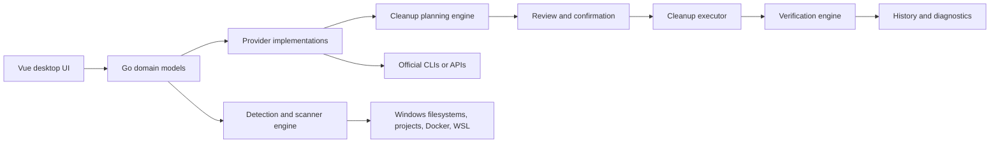

# Architecture and implementation

The M1 bootstrap is implemented in commit `5ba3fe8`. `main.go` hosts the Wails application, `AppService` exposes typed bindings, `internal/core` owns provider lifecycle models, and `internal/history` persists verified outcomes. Eleven developer-tool provider slices are implemented through commit `163295b`; the working tree adds discovery-first availability so the UI displays inspectable cards only for supported host providers, keeps configuration prerequisites concise, and collapses unavailable diagnostics. The minimal workspace-root contract remains intentionally narrower than a Project storage page, broad scanner, filter, or analytics surface.

The M1 elevation continuation is implemented in `6ee788d`, with controlled probe modes/UI pending state in `8fc559a` and the consent/execution timing fix in `d0bc468`. `internal/elevation` owns a fixed `m1.elevation.probe` request contract, persistence, helper execution, and a status controller. `elevation_launcher_windows.go` launches the current executable through the Windows `runas` verb; `elevated_helper.go` accepts only `--elevated-helper --elevation-request-id <opaque-id>`, then loads and validates the stored request. The only allow-listed action is a no-op probe. The UI exposes exactly three modes: `consent` has no delay, `cancellation-test` waits for half of the fixed operation window, and `timeout-test` deliberately waits 250 ms beyond that window so timeout wins without an equality race. It passes Wails-generated `ProbeMode` values, sets a local pending state before the asynchronous start returns, and disables competing starts. No provider command, cleanup path, or arbitrary process is represented in the contract.

Contract version 2 separates request creation from execution activation. `NewRequest` records creation time and the allow-listed duration but no execution deadline. After synchronous `Launcher.Launch` returns successfully, `Controller.run` calls `Activate`, atomically persists `ExecutionStartedAt` and `ExecutionDeadline`, and starts its timer against that deadline. An elevated helper that wins the process-start race polls the request for up to five seconds until activation is published. Regression tests simulate consent taking longer than the execution timeout and prove that both immediate success and timeout begin after consent. Full Docker verification/build passed; Windows acceptance observed success, cancellation, timeout, and the full visible fixture lifecycle. Explicit UAC refusal remains unverified only because the current host's Never notify setting auto-approves `runas`.

The M2 implementation has the generic core `Provider` interface, an `AppService` registry, backend plan map, and eleven real providers: Bun 1.x, npm 10/11, conditional pnpm 11/12, uv 0.12.x, Yarn Classic 1.x, .NET SDK 6+ NuGet HTTP cache, Cypress 13–15 binary cache, Cargo 1.70+ workspace target, Gradle 8/9 root build output, Maven 3/4 workspace target, and Playwright 1.40+ hermetic local browsers. `internal/providers/common` centralizes command execution, broad-path rejection, symlink-safe traversal, overflow checks, path equality, Windows child-process creation with `CREATE_NO_WINDOW`, and workspace-root/target validation. `internal/providers/managedcache` supplies the fixed lifecycle guard used by the global-cache slices. `internal/providers/projectcleanup` applies the same confirmation, backend-plan, same-path, and before/after measurement rules to a single approved workspace root. `SetWorkspaceRoot` validates and stores one temporary regular-directory root; a changed root invalidates reviewed project plans. Cargo invokes only `cargo clean --manifest-path`; Gradle only its regular root wrapper `:clean`; Maven only `mvn -f pom.xml clean`; Playwright only local hermetic browser uninstall with `PLAYWRIGHT_BROWSERS_PATH=0`. None receives a frontend cleanup target, touches user-home tool storage, or implements general M4 discovery.



## Boundary rules

- Vue renders provider, category, action, risk, recovery-cost, size, progress, and history domain models. It does not own raw shell commands.
- A provider owns detection, inspection, estimate, plan, execution, verification, version-aware semantics, and user-facing consequence data for one ecosystem.
- The planning engine creates explicit reviewable actions before any destructive operation begins.
- The executor handles cancellation, timeout, logs, errors, elevated operations, and partial completion.
- The verification engine remeasures provider state and physical disk state when meaningful, then records actual outcomes.
- Docker resource classes and virtual disks are not treated as interchangeable cache locations.

## Build-environment boundary

All project dependency installation, code generation, verification, tests, builds, and packaging execute inside Docker. The Windows host may run the editor, Git, Rancher Desktop/Docker, and `docker compose` only as the orchestrator; it does not provide a Go, Wails, Bun, Vue, or Windows packaging toolchain for PenguinSpace.

The frontend contract is Vue 3 + TypeScript + Vite, using pinned Bun `1.3.14` as the only JavaScript package manager and script runtime. The repository will commit `bun.lock` only; it will not introduce a Node/Corepack requirement or competing JavaScript lockfile. The initial frontend source must include `src/vite-env.d.ts`, with the `vite/client` reference and a `*.vue` module declaration, so the Bun-created Vue template type-checks reliably.

`Dockerfile` copies the pinned Bun binary into the pinned Go image and installs Wails CLI `v3.0.0-beta.6`. Compose provides `verify`, `build`, and `shell`; its Go module/build, Bun download, and frontend `node_modules` caches are named volumes. `verify` runs locked Bun installation, binding generation, Vue checks/build, Go internal vet/tests, and a Windows cross-compile. Windows packaging requires an explicit semantic version and writes `out/penguinspace-v<version>.exe`; it never automatically replaces the unversioned compatibility path or an existing versioned artifact. PowerShell delegates under `scripts/` call Compose only.

## Persistence and privilege boundaries

Measurements are stored as exact `uint64` byte values with a separate kind: `measured-logical`, `estimated-logical`, `measured-physical`, or `unavailable`. An observed total and an estimated reclaim are distinct fields, so a provider such as pnpm can truthfully show the store size without claiming those bytes are pruneable. Formatting into IEC units is a presentation concern only.

The implemented store uses pure-Go `modernc.org/sqlite` `v1.56.0`. It creates a SQLite database at `%LOCALAPPDATA%\\PenguinSpace\\penguinspace.db` on Windows. Schema version 2 adds `reclaimed_kind` beside exact reclaimed bytes; version-1 rows migrate with `measured-logical`, while a database whose `user_version` is newer than supported is rejected without modification. Fixture, developer-provider, and verified exact-network outcomes are persisted; a Docker network outcome records `unavailable` rather than treating zero bytes as a measured reclaim. Settings and complete plan/outcome persistence belong to later product surfaces, while retention and diagnostics belong to production hardening. The application does not open an untrusted database file as its own state.

The desktop process remains non-elevated. Developer-tool cache cleanup runs without the M1 elevation helper and is guarded by an inspected backend-owned plan plus path revalidation. The implemented elevated helper remains limited to the M1 no-op probe. A privileged operation for another real provider remains planned: it must be a validated, narrowly scoped plan passed to a separate UAC `runas` helper and must not reuse this test-only probe contract.

## Provider lifecycle

```text
Detect → Inspect → Measure → Classify → Estimate → Plan → Confirm → Execute → Verify → Record history
```

The UI can display a plan only after classification. A plan must expose provider/item, current and estimated reclaimable size, risk, recovery cost, consequence, privilege requirement, shutdown prerequisite, and verification approach.

## Discovery-first provider availability

`AppService.DiscoverDeveloperProviders` performs only provider detection under one bounded context; it does not scan filesystem bytes, create cleanup plans, or execute cleanup. It returns ordered availability records: available, needs configuration, unavailable, not applicable to the selected workspace, or workspace required. The Vue shell renders full inspect cards only for available providers, shows detected configuration prerequisites such as pnpm's missing explicit `storeDir` as compact notices, and places unavailable host tools in a collapsed diagnostic section. Project-scoped providers are first checked against their marker validation (`Cargo.toml`, Gradle root configuration, `pom.xml`, or `package.json`) after the user approves a root; non-matching project providers are not rendered. Existing host-only provider semantics remain unchanged: Docker-held CLIs, cache mounts, images, and BuildKit layers are outside this M2 discovery surface.

For Bun, the current UI exposes logical measurement and the consequence that hardlinks can make physical reclaim lower. For npm, it exposes only `_cacache` bytes and warns that logs/npx are out of scope. For pnpm, an implicit per-disk store produces detection plus an explanation but no action; an explicit `storeDir` produces observed total bytes and an unavailable estimate until `store prune` completes. For uv, the total cache is observed while reclaimable bytes remain unavailable until prune; the consequence explicitly includes removal of centralized project environments and possible package downloads or source rebuilds. Yarn is limited to Classic 1.x global cache via `yarn cache dir` and `yarn cache clean`; modern Yarn caches remain excluded without M4 project context. NuGet is limited to the .NET SDK 6+ `http-cache` list/clear pair; global packages, temp, and plugins remain excluded. Cypress 13–15 measures its binary-cache root and uses only `cypress cache prune`, so its pre-prune reclaim estimate remains unavailable and the currently used binary is retained. Each new provider test covers supported/unsupported or missing detection, plan classification, required confirmation, scope change rejection, execution, and verified logical measurement. Cargo, Gradle, Maven, and Playwright use only the minimal approved workspace-root contract; broad project discovery, recursive scanning, filters, and analytics remain deferred to M4. None claims physical reclaimed bytes.

## M3.1 read-only Docker awareness

`internal/dockerinventory.Inspector` owns a fixed observation sequence through the existing no-console command runner. It first resolves `docker`, checks the server with a JSON-formatted version request, then reads daemon-wide disk-usage summaries and independently lists unique images, stopped containers, BuildKit cache records, custom networks, and volumes. Every invocation has hard-coded arguments; no Docker command, filter, ID, or path crosses from Vue. Missing CLI or daemon produces a non-actionable status, while category-level failures produce warnings and unavailable fields rather than invented zero-byte claims.

`AppService.InspectDockerAwareness` applies a 20-second context and returns `DockerAwareness`, `DockerDaemonStatus`, and ordered `DockerResourceSummary` models. The model separates count availability from byte measurement availability and labels volumes as stateful. Category commands provide counts; disk-usage byte summaries are daemon-wide. Stopped-container bytes remain unavailable rather than mixing their count with all-container storage, and the BuildKit boundary does not claim that active-builder record count is project ownership. The Vue Containers & WSL surface displays these observations but has no review, plan, execute, prune, or delete path. `docker system df` values are not physical Windows/VHDX reclaim evidence and are not attributed to a workspace.

## M3.2 ownership/scoping boundary

The accepted future grouping key is the exact `com.docker.compose.project` label. Resource-specific canonical labels (`service`, `network`, or `volume`) may refine display names. Missing, conflicting, or malformed labels produce an explicit unscoped group; repository paths, name prefixes, image tags, creation time, and BuildKit descriptions are never ownership fallback. Grouping is presentation metadata only and cannot create a cleanup plan.

Relationship observations must remain ID-backed: image references from containers, container status, network attachment IDs, and volume mount references. They can change after inspection and require action-time revalidation if cleanup is ever designed. The current runtime had no containers, two unattached custom Compose networks, and ten unmounted Compose volumes; absence of a current relationship does not mean disposable.

BuildKit remains a separate selected-builder scope. Its records expose mutable/shared/reclaimable metadata but no canonical project identity; M3.2 observed 40 records with 22 shared. Volumes remain Stateful/Danger regardless of project label or mount count. No executor or cleanup model is authorized.

## M3.3 ownership presentation implementation

`DockerAwareness` preserves the ordered daemon-wide `DockerResourceSummary` list and adds `DockerOwnershipGroup`, `DockerScopedResource`, canonical Compose label fields, typed relationship observations, `OwnershipComplete`, and `DockerBuilderScope`. The explicit `unscoped` group is always returned. A project group requires a valid lowercase Compose project name and no resource-type-conflicting service/network/volume labels; missing, malformed, and conflicting metadata fail closed to `unscoped` without inference.

The inspector lists backend-owned identifiers, then uses bounded batches of at most 48 arguments for image, container, network, and volume inspect calls. All containers contribute image-reference and named-volume-mount counts; only created/exited/dead containers become ownership cards. Network attachment maps and container mounts supply point-in-time counts. Every dependent relationship carries an availability flag. Failed lists, failed inspect batches, or malformed rows emit warnings and make `OwnershipComplete` false, so omitted resources cannot be presented as a complete empty/unscoped result.

BuildKit remains outside project groups. `docker builder du --format json` yields ID-backed selected-builder records and shared/mutable/reclaimable flags; daemon-wide cache bytes remain separate. Vue renders daemon totals, project/unscoped resources, relationships, and builder metrics as observation-only surfaces. Volumes receive `RiskDanger`, Stateful styling, and no action. Refresh clears the prior awareness payload before requesting a new one. No cleanup endpoint, plan, prune/delete command, frontend-supplied Docker argument, or mutation control exists.

Final Compose verification regenerated 12-method/25-model bindings, passed Vue type-check/build, gofmt, vet, internal tests, and Windows production cross-build. Live read-only commands against Docker Engine 29.5.3 confirmed 3 images, 0 containers, projects `docker` and `penguinspacestudio`, 1 unscoped image, 2 custom networks with zero attachments, 10 volumes with zero mounts, and 40 selected-builder records including 22 shared. Windows UAT on `out/penguinspace-v0.1.3.exe` then confirmed the complete available presentation—including 8 `docker` resources, 6 `penguinspacestudio` resources, one explicit unscoped image, Stateful/Danger volumes, and selected-builder 40/22 shared/5 mutable metrics—and the unavailable refresh state with every prior Docker card removed. No cleanup control or mutation was exposed.

## M3.5 exact-network removal implementation

`internal/dockerinventory.NetworkRemovalController` retains one backend-issued plan at a time. `InspectDockerNetworkRemoval` accepts an exact network ID only as a review selector, then independently reruns the complete ownership snapshot. Eligibility requires a one-to-one set of list/inspect identities, valid canonical Compose project and network labels, and exactly one available zero-attachment relationship. Missing/null `Containers` metadata, malformed rows, partial batches, conflicting labels, and unscoped or attached networks cannot issue a plan.

`ExecuteDockerNetworkRemoval` accepts the retained plan ID and explicit confirmation, consumes the plan, resolves Docker again, and immediately inspects that exact ID. Identity, name, project label, network label, and non-null zero attachments must still match. The only mutating invocation is `docker network rm <retained-ID>`; there is no force, prune, batch, name fallback, or path/argument channel. Exact-ID listing verifies absence. If the CLI reports an error after daemon-side mutation, an independent refresh context reruns exact-ID verification before the broad awareness refresh; a proven absence becomes a verified outcome while retaining the CLI warning, and an unavailable/present result remains a structured follow-up state.

`DockerNetworkRemovalOutcome` independently records command attempted/completed, exact absence, awareness refresh, history persistence, unavailable reclaimed bytes, and failure text. The result is returned even when post-command verification or local history persistence fails, so known mutation state is not lost behind a rejected bridge call. Verified outcomes are written as provider `docker.network` with measurement kind `unavailable`. Vue offers **Review exact removal** only for complete, canonically labeled, unattached network observations, then displays the retained boundary and requires explicit confirmation; outcome status sits outside daemon-available rendering so reconciliation remains visible after daemon loss.

Deterministic fake-runner tests cover incomplete and mismatched inspect identity sets, absent attachment metadata, action-time attachment changes, confirmation/plan retention, exact command arguments, post-command absence checks, available/unavailable-daemon reconciliation after mutate-then-error, history failure, and prohibition of force/prune. Full Compose verification passed 14 service methods, 7 enums, 27 models, Vue type-check/build, formatting, vet, all internal tests, and Windows cross-build. No existing Docker network was used or removed.

## M3.6 read-only WSL/VHDX discovery

`internal/wslinventory.Inspector` owns three fixed commands: `wsl.exe --list --quiet`, `--list --running --quiet`, and `--list --verbose`. `common.SystemRunner.RunRaw` preserves command bytes so WSL-specific decoding can strictly accept UTF-8, BOM-tagged UTF-16LE/BE, and only unambiguous alternating-NUL BOM-less UTF-16. Odd lengths, malformed surrogates, ambiguous encodings, duplicate quiet/running/verbose identities, and command diagnostics fail closed instead of being repaired or case-folded.

Current-user registration discovery reads paired `DistributionName` and `BasePath` values under the WSL `Lxss` key. Any enumeration, open, value-read, close, or context error discards every registry result for that inspection. CLI-to-registry correlation is exact-case; duplicate identities enter a permanent ambiguity set. Allocation lookup additionally requires affirmative unambiguous WSL 2 version evidence. No package-name inference, filesystem scan, prefix match, or guessed path can authorize `ext4.vhdx`.

The Windows allocation adapter opens the exact candidate with `FILE_READ_ATTRIBUTES`, shared read/write/delete access, and `FILE_FLAG_OPEN_REPARSE_POINT`. `FileAttributeTagInfo` rejects reparse points and directories; `FileStandardInfo.AllocationSize` supplies `measured-physical`. `EndOfFile` is retained only to prove in tests that logical EOF is not surfaced as host allocation. Logical distro usage and compactable bytes always remain `unavailable`. A non-Windows adapter cannot measure VHDX allocation.

`AppService.InspectWSLAwareness` exposes this bounded report to Vue. The frontend uses a closed `MeasurementKind` union and displays physical bytes only when `pathAvailable` is true and the kind is exactly `measured-physical`; mismatched, unknown, logical, and compactable values display **Unavailable**. There is no plan, confirmation, elevation, cleanup, shutdown, terminate, mount, manage, sparse, optimize, compact, import/export, unregister, or arbitrary argument endpoint.

Tests cover partial registry rejection, exact-case mismatch, permanent two/three-plus ambiguity, duplicate verbose rows, strict CJK/surrogate/BOM/BOM-less decoding, malformed output, raw UTF-16 diagnostics, command prohibition, and allocation-size-versus-EOF behavior. Windows-native tests create a sparse file to prove `AllocationSize < EndOfFile` and a symlink to prove real reparse rejection. Final Compose verification passed 15 methods, 8 enums, 30 models, Vue type-check/build, formatting, vet, all internal tests, and Windows production cross-build; final semantic review found no Critical, High, or Medium issue. Installed-distribution layout and Windows visual behavior remain unverified.

M3.6 is implemented. All WSL/VHDX mutation remains separately unauthorized.

## M4.1 read-only project discovery

`internal/projectinventory.Inspector` performs one bounded, read-only pass below exactly one workspace root that `common.ValidateWorkspaceRoot` revalidates at inspection time. Its only filesystem seam is a `DirectoryReader` with a single `ReadDir` method, so the package has no create, write, rename, or remove capability; the seam exists so fail-closed branches such as a permission denial are covered deterministically instead of depending on host privileges.

A project exists only where an exact-case marker file was found: `package.json`, `Cargo.toml`, `pyproject.toml`, `pom.xml`, or a Gradle root `settings.gradle`/`settings.gradle.kts`/`build.gradle`/`build.gradle.kts`. A generated directory is reported only when its name is on the fixed allow-list (`node_modules`, `target`, `.venv`, `.next`, `dist`, `build`, `.gradle`, `.turbo`) and one of that name's rules matches an ecosystem detected in the same directory; the rule slice fixes the claiming priority, so `target` resolves to Cargo before Maven and `build` to Gradle before a JavaScript project. Every artifact is `StorageRebuildable` with `RiskReview`, a per-name recovery cost, and a `MeasurementUnavailable` measurement. Nothing in this package measures bytes, estimates reclaim, issues a plan, or removes a path.

Traversal is bounded by fixed depth, directory-count, and project-count limits that `NewInspector` restores whenever a caller passes a non-positive value. Reparse points are recorded and never followed; `.git`, `.hg`, and `.svn` are recorded and never traversed; a claimed artifact is reported without descending into it; and an allow-list name without a claiming marker is recorded as explicitly unclaimed rather than traversed or presented as an artifact. Directory-name boundaries match case-insensitively because Windows volumes are case-insensitive, while marker detection stays exact-case so a mismatch can only claim less. Because a cached parent entry can be stale, the resolved path is re-checked with a no-follow `Lstat` immediately before it is read, so a directory that became a reparse point after the descend decision is skipped instead of escaping the root.

Failures fail closed. A read or revalidation error records the path, emits a warning, and clears `Complete`; an exhausted depth, directory, project, or recorded-skip bound sets `Truncated` and clears `Complete`; a cancelled context stops the pass with a warning. The summary counts only directories that were actually read, so an omission is never presented as absence.

`AppService.DiscoverProjectStorage` serializes discovery under its own mutex, requires an approved root, and applies a 30-second context. The Vue **Projects** surface renders projects, markers, ecosystems, claimed artifacts with **Unavailable** sizes, and the recorded skip list. Its status badge is authoritative only when the snapshot is approved, complete, and untruncated, and its zero-project message refuses to describe an incomplete snapshot as an empty root. No inspect, review, confirm, plan, or delete control exists on this surface.

## Required core models

- Provider and detected environment
- Storage item and storage class
- Cleanup action and cleanup plan
- Risk and recovery-cost enums
- Measurement, estimate, logical deletion result, and physical reclamation result
- Execution status, progress, cancellation/error outcome, log/diagnostic context
- Scan result and cleanup-history record
- Workspace root, exclusions, and scanner rule

## Docker and WSL design constraints

Docker M3.1 inspection distinguishes build cache, images, stopped containers, custom networks, and volumes. Volumes are persistent-state candidates and visually Stateful/Danger, but this slice exposes no cleanup. Category counts and daemon-wide `docker system df` summaries are distinct observations, not project ownership or physical-host reclaim claims; stopped-container bytes remain unavailable because the daemon summary includes all containers.

Future Docker cleanup must preserve these categories and establish ownership/scoping evidence before planning. WSL/VHDX needs a separate measurement path: distro/filesystem logical usage, backing VHDX path, physical size, estimated compactability, and physical size after compaction. Logical deletion is never evidence of host-disk reclaim until post-operation verification.

## Proposed UI architecture

The app shell contains the left navigation and compact/responsive behavior. Domain pages use metrics, horizontal breakdowns, dense tables/lists, master-detail interactions, detail panes, review dialogs, progress, and contextual warning/confirmation surfaces. Design details are in [penguin-space.useguide.md](penguin-space.useguide.md).
